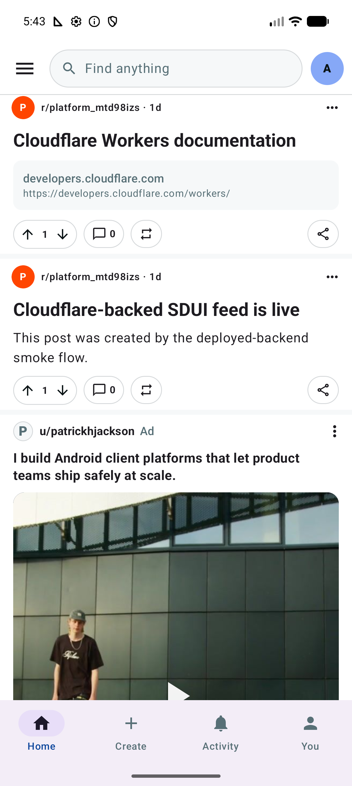
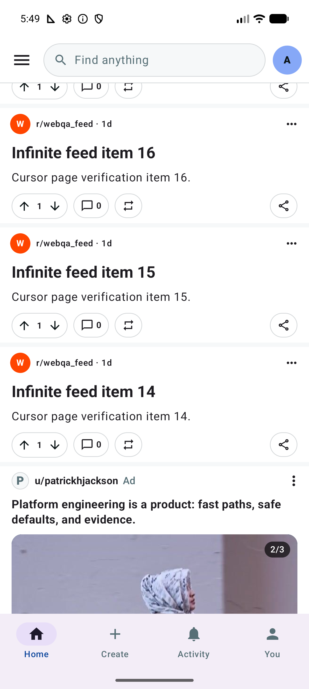
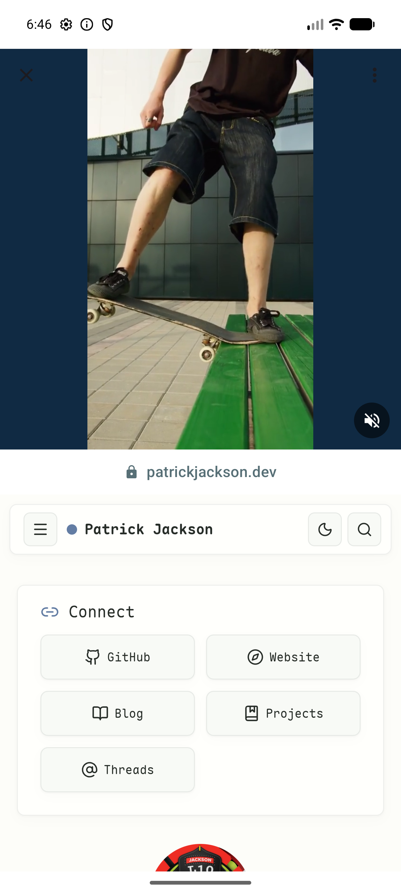

# Server-driven portfolio promotions

This sample now supports Reddit-shaped promoted units without pretending to be a
full advertising platform. There is no auction, targeting, billing, attribution
SDK, or third-party tracker. The Worker owns a small editorial catalog whose
purpose is to present Patrick Jackson's Android platform work inside the feed.

The live Reddit Android reference review and captured screens are documented in
[`reddit-ads-reference/README.md`](reddit-ads-reference/README.md).

## Product behavior

A promoted unit is one normal SDUI group. The Worker controls the cell order and
the Android client resolves each cell through the existing converter registry and
flattener:

```text
WireGroup("promoted:patrick-platform-01")
  ad_header
  ad_title
  ad_media          one item or a horizontal carousel
  ad_summary
  ad_related_posts  horizontal carousel
  ad_actionbar
  divider           client-generated group boundary
```

The Android home request opts in with `includePromoted=true`; this prevents other
clients that do not yet implement these cell types from receiving empty groups.
Its first page interleaves the two demo units after organic positions 3 and 8.
They are not inserted in subreddit feeds or cursor pages and never participate in
ranked pagination, so the existing signed organic cursor remains stable. The
in-process fake emits the same two units for deterministic tests and screenshots.

The current content source is
[`backend/src/promoted.ts`](../backend/src/promoted.ts). Replace its media URLs,
copy, destination, and related post IDs when the final portfolio assets are ready.
Keep each `adId` stable across copy/media revisions if the unit is logically the
same campaign; use a new `creativeId` when a media asset changes.

The destination is `patrickjackson.dev`, verified in the embedded lower pane during
the August 29 device smoke test. If the site is temporarily unavailable, detail
keeps the video usable and presents a branded retry state instead of WebView's
raw network-error page.

## Wire contract

The media cell carries all destination data required for a self-contained tap:

```json
{
  "type": "ad_media",
  "cellId": "media",
  "adId": "patrick-systems-02",
  "destinationUrl": "https://patrickjackson.dev",
  "displayDomain": "patrickjackson.dev",
  "ctaLabel": "View work",
  "items": [
    {
      "creativeId": "adaptive-media",
      "kind": "video",
      "aspectRatio": 0.8,
      "hlsUrl": "https://…/manifest/video.m3u8",
      "posterUrl": "https://…/thumbnail.jpg",
      "cacheKey": "ad:patrick-systems-02:adaptive-media"
    },
    {
      "creativeId": "sdui-architecture",
      "kind": "image",
      "aspectRatio": 0.8,
      "imageUrl": "https://…/architecture.jpg",
      "cacheKey": "ad:patrick-systems-02:sdui-architecture"
    }
  ]
}
```

`adId` is the unit and analytics identity. `creativeId` is the selected media,
navigation, and cache identity. A media list of length one renders as a normal
stage; a longer list automatically renders as a snapping pager with an `n/total`
counter. All items in one carousel should use the same aspect ratio to avoid
layout movement while swiping.

Unknown future cell types still follow the existing forward-compatibility rule:
they are dropped and counted while the rest of the group renders.

## Feed and detail interaction

- Feed video autoplays muted only while selected by the existing visibility
  policy. Images and non-active carousel pages render posters.
- Tapping media or the CTA opens a typed `AdDetailRoute` carrying the selected
  creative and destination.
- Feed and ad detail use the same process-wide Media3 coordinator, stable cache
  key, and player. `PlayerView.switchTargetView` transfers the decoder so a
  playing video continues rather than restarting or creating a second player.
- The completed feed overlay offers `REPLAY VIDEO` and the configured CTA.
  Replay enters detail at the beginning; the CTA preserves the completed state.
- Detail uses a square top stage, centers the 4:5 creative inside it, then shows
  a 48 dp secure-domain strip and an in-app `WebView` below. The WebView disables
  file/content access and mixed content, enables Safe Browsing, and is destroyed
  when the destination leaves composition.

## Analytics contract

All events enter the existing Room outbox, batch uploader, strict Worker schema,
and Cloudflare Analytics Engine dataset. The Worker pseudonymizes account/install
and content IDs before storage and rejects titles, raw URLs, and other unbounded
attributes.

| Event | Trigger | Measurements |
|---|---|---|
| `ad_impression` | Media cell remains at least 50% visible through the 600 ms dwell gate | stable `adId`, surface |
| `ad_view_time` | A viewable media cell exits or the feed leaves composition | active milliseconds |
| `ad_click` | Media or replay overlay tap | carousel page in `position` |
| `ad_cta_click` | CTA strip or overlay tap | carousel page in `position` |
| `ad_carousel_swipe` | Selected media page changes after initial display | page in `position` |
| `ad_related_click` | Related-post card tap | stable `adId` |
| `ad_video_play` | Playback enters playing | starting media milliseconds in `position` |
| `ad_video_watch` | Playback pauses, ends, transfers surface, or disposes | active milliseconds, start position, completion percent, reason |
| `ad_video_complete` | Playback first reaches ended | 100% completion |
| `ad_detail_view` | Hybrid detail enters composition | stable `adId` |
| `ad_landing_load` | Main-frame WebView load finishes or fails | load milliseconds and error reason |

`ad_impression` and `ad_detail_view` are session-deduplicated by the Android
recorder. Plays, time, clicks, carousel movement, and landing loads remain
counted events. The funnel and watch-depth queries are in
[`backend/analytics/product-queries.sql`](../backend/analytics/product-queries.sql).

## Implementation map

- Wire schema: [`feature/feed/src/main/kotlin/dev/readthat/domain/Wire.kt`](../feature/feed/src/main/kotlin/dev/readthat/domain/Wire.kt)
- Pure conversion/UI models: [`feature/feed/src/main/kotlin/dev/readthat/domain/Converters.kt`](../feature/feed/src/main/kotlin/dev/readthat/domain/Converters.kt)
- Feed rendering and media carousel: [`feature/feed/src/main/kotlin/dev/readthat/ui/AdCells.kt`](../feature/feed/src/main/kotlin/dev/readthat/ui/AdCells.kt)
- Viewability integration: [`feature/feed/src/main/kotlin/dev/readthat/ui/FeedScreen.kt`](../feature/feed/src/main/kotlin/dev/readthat/ui/FeedScreen.kt)
- Hybrid destination: [`app/src/main/kotlin/dev/readthat/ui/ads/AdDetailScreen.kt`](../app/src/main/kotlin/dev/readthat/ui/ads/AdDetailScreen.kt)
- Worker catalog/insertion: [`backend/src/promoted.ts`](../backend/src/promoted.ts)
- Analytics validation: [`backend/src/product-analytics.ts`](../backend/src/product-analytics.ts)

## Rendered smoke captures

These were rendered from the local Worker contract on an Android 17 emulator;
the media is intentionally placeholder content.

| Single-video unit | Carousel, page 2 | Hybrid detail + live portfolio site |
|---|---|---|
|  |  |  |
