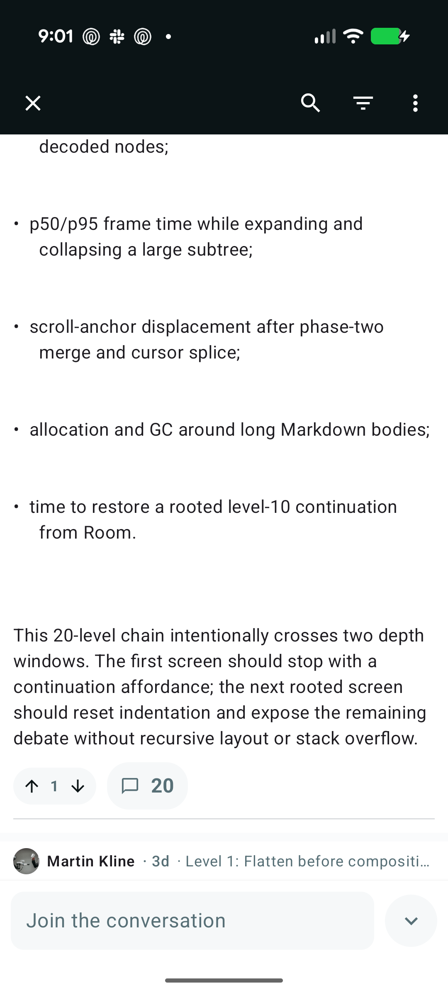
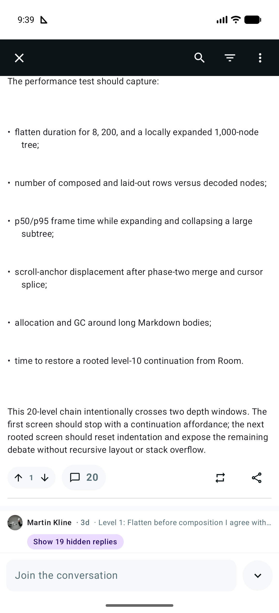

# Counting What Disappears: Fast, Honest Collapse UX for Comment Trees

*ReadThat engineering · September 1, 2026*

Collapsing a long comment branch used to create an information gap. ReadThat kept
the parent visible, but the reader could not tell whether the tap hid one reply or
an entire discussion. The final UI adds a compact action beneath the collapsed
preview:

> **Show 19 hidden replies**

That looks like a copy change. The interesting part is defining “19” correctly
without adding a request, a client-side tree walk, or work to time to interactive.

## Before and after

These screenshots use the same 20-comment seeded discussion on Android 17. The
before image records the original build; the after image records the corrected
build with the same root comment collapsed.

<table>
  <tr>
    <th scope="col">Before: no visible magnitude</th>
    <th scope="col">After: the complete branch is explicit</th>
  </tr>
  <tr>
    <td></td>
    <td></td>
  </tr>
</table>

The post has 20 comments arranged as one chain: the visible root plus 19
descendants. Only ten descendants fit in the depth-10 response, but response depth
is a transport concern, not the reader's model of the conversation. The label is
therefore 19 and remains 19 before and after loading the continuation.

## UX tradeoffs: count the logical subtree

We considered terse badges such as `+19`, passive copy such as “19 replies,” and
“Expand to see 19 more.” The chosen phrase, “Show 19 hidden replies,” combines an
action with the consequence of the reader's collapse:

- **Show** makes the pill an explicit expansion target.
- **hidden** ties the number to the current collapsed state.
- **replies** describes the size of the branch, with singular and plural forms.

The control is secondary to the comment but easier to discover than a tiny badge
beside the author. Readers may tap the header or the pill; accessibility state
announces the same count.

The subtle question is whether “hidden” means only comments already materialized
on the device or every descendant in the logical branch. We initially chose the
first definition. It produced “Show 10 hidden replies” on a 20-comment chain,
because the server stopped materializing at depth 10. That was internally
consistent and externally surprising. It also made the label change as pagination
loaded, turning a stable fact about the conversation into an implementation leak.

The corrected design uses the complete subtree. Expanding still reveals the
materialized comments plus the existing “load more” row; it does not promise that
all 19 bodies arrive in one frame. The number describes branch magnitude, while
the cursor separately describes remaining network work. That split matches what a
reader wants to know: “How much discussion did I collapse?”

This was a high-confidence correction rather than an A/B-test candidate. The
20-comment post already displayed an authoritative total, and one visible root
leaves 19 descendants. Aligning those numbers removes ambiguity without changing
the interaction.

## Technical tradeoffs: move work away from reads

ReadThat stores comments as an adjacency list and uses a max-heap to select the
highest-ranked eligible nodes for fixed `count=8` and `count=200`, `depth=10`
responses. Selection controls presentation; it cannot be allowed to redefine
subtree size.

| Option | Read and client cost | Correctness and complexity |
| --- | --- | --- |
| Walk the client tree on collapse | O(materialized subtree) on the interaction path | Still cannot count replies behind cursors |
| Sum the heap-selected response bottom-up | O(selected nodes), no extra request | Fast, but produced the incorrect response-local count of 10 |
| Run a recursive database query for every returned node | Adds read latency and repeated ancestor work | Exact, but makes the hottest endpoint pay |
| Store total descendants and update ancestors on writes | O(1) per returned node; no client work | O(depth) reply writes and one schema invariant |

We chose the last option. Comment trees are read far more often than individual
replies are written, and ReadThat already enforces a maximum write depth. The
migration adds `comments.descendant_count`, backfills existing data once with a
recursive common-table expression, and replaces the insert trigger. A new reply
increments every ancestor in one SQLite statement:

```sql
UPDATE comments
SET descendant_count = descendant_count + 1
WHERE id IN (
  WITH RECURSIVE ancestors(id) AS (
    SELECT NEW.parent_id
    UNION ALL
    SELECT parent.parent_id
    FROM comments parent
    JOIN ancestors ON parent.id = ancestors.id
    WHERE parent.parent_id IS NOT NULL
  )
  SELECT id FROM ancestors WHERE id IS NOT NULL
);
```

For a branch of depth `d`, creating a reply updates `d` small integer cells. Tree
reads already fetch comment rows, so serializing the total is O(1) per selected
node. The heap's selection and assembly complexity is unchanged, and the solution
remains exact even when the server bounds its working corpus or inserts a depth
cursor.

The price is write amplification on deep threads and a denormalized invariant.
That is preferable here to recursive read amplification: collapse and initial
render are latency-sensitive and common, while comment creation is explicit,
already network-bound, and capped at depth 1,000. SQLite/D1 executes the insert and
trigger atomically, avoiding lost increments between concurrent replies.

## Network and caching

The API still sends one `descendantCount` integer inside each comment object. There
is no extra endpoint, request waterfall, or client database lookup. Repeated JSON
property names and small integer values compress well; more importantly, count
metadata arrives with the tree that needs it.

The semantic correction does require cache isolation. ReadThat's comment-tree
cache is keyed by post, fixed count/depth, logical root, post version, and a
five-minute TTL. Cache key version `v3` prevents an older response-local value from
being served as a total after deployment. Existing client payloads remain
decodable, while the next normal refresh replaces them with authoritative totals.

Loading more comments must not increase the count: a cursor was already included
in the logical subtree. Android and web therefore preserve ancestor totals when a
cursor is replaced. An optimistic reply is different—it creates a new logical
descendant—so both clients add one along the copied ancestor spine and subtract it
on rollback. Votes preserve the value. No mutation performs a full-tree recount.

## Final implementation

The corrected data flow is deliberately small:

1. Backfill and maintain `comments.descendant_count` in SQLite.
2. Read the stored value during full-tree and load-more serialization.
3. Bump the server tree-cache contract from `v2` to `v3`.
4. Preserve totals during cursor materialization.
5. Adjust only the ancestor spine for optimistic insert, replacement, and removal.
6. Read the integer at a collapsed boundary and render pluralized, accessible copy.

Regression tests build a 14-comment chain and assert that both `count=8` and the
depth-limited `count=200` response report 13 descendants. They also inspect the
database invariant directly, verify cache hits, preserve totals through load-more,
and exercise optimistic edits on a 1,500-level tree without recursion.

The result is a stable answer to a simple user question with no added client
latency. The broader lesson is that pagination metadata and domain metadata are
not interchangeable. A heap can decide which comments to send now; it should not
decide how many comments exist below a node.

## Code landmarks

- [`backend/migrations/0014_comment_descendant_count.sql`](../backend/migrations/0014_comment_descendant_count.sql) — backfill and write-side invariant
- [`backend/src/comments.ts`](../backend/src/comments.ts) — heap selection, serialization, and cache versioning
- [`shared/src/commonMain/kotlin/dev/readthat/comments/domain/CommentWire.kt`](../shared/src/commonMain/kotlin/dev/readthat/comments/domain/CommentWire.kt) — shared total-count contract
- [`shared/src/commonMain/kotlin/dev/readthat/comments/domain/CommentTreeEditor.kt`](../shared/src/commonMain/kotlin/dev/readthat/comments/domain/CommentTreeEditor.kt) — optimistic ancestor deltas
- [`shared/src/commonMain/kotlin/dev/readthat/comments/domain/CommentTreeSplicer.kt`](../shared/src/commonMain/kotlin/dev/readthat/comments/domain/CommentTreeSplicer.kt) — cursor replacement without recounting
- [`www/src/logic.ts`](../www/src/logic.ts) — matching web invariants
