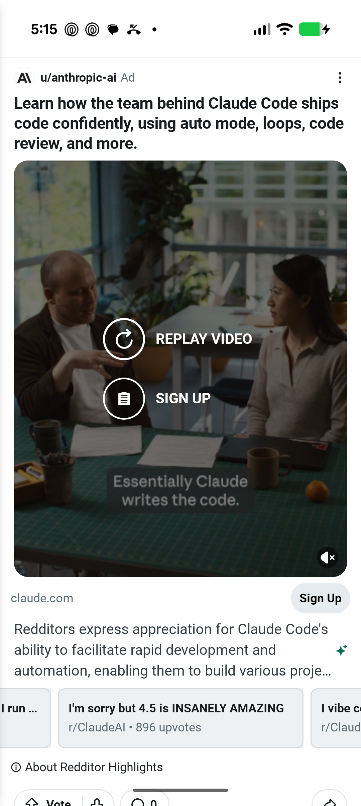
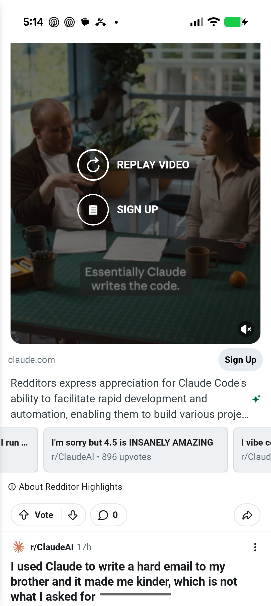
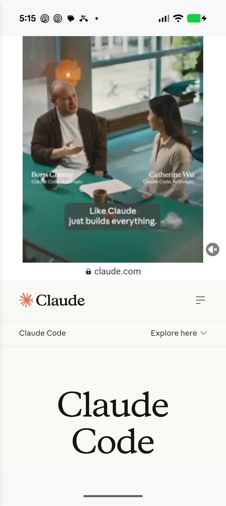

# Reddit Android promoted-feed reference

Captured on August 29, 2026 from Reddit Android `2026.33.2` running on a physical
Pixel 10 Pro (Android 17). The device was 1080 × 2410 px at 420 dpi with font scale
1.15. These are visual/behavioral observations of the public app—not extracted
Reddit implementation details.

## Feed anatomy

The observed promoted unit follows the same vertical rhythm as an organic post:

1. Avatar, `u/username`, `Ad`, and overflow menu.
2. Bold multiline title.
3. Inset rounded media with muted video controls.
4. Display domain and pill CTA.
5. Three-line summary with a sparkle disclosure affordance.
6. Horizontally clipped related-post cards.
7. `About Redditor Highlights` disclosure.
8. Vote, comment, and share footer.

At video completion, Reddit darkens the media and presents two centered actions:
`REPLAY VIDEO` and the campaign CTA. The sound control remains anchored at the
bottom-right of the media.

Approximate measurements derived from the 1080 px UI hierarchy/screenshot and
the device's 2.625 px/dp density:

| Element | Observed value | Clone target |
|---|---:|---:|
| Feed horizontal inset | 42 px ≈ 16 dp | 16 dp |
| Header avatar | 63 px ≈ 24 dp | 24 dp |
| Media corner radius | ≈ 14–16 dp | 14 dp |
| Primary creative ratio | 4:5 | 4:5 |
| Domain/CTA row | ≈ 48 dp | ≈ 48 dp |
| Related card width | ≈ 260–280 dp | 260 dp |
| Hybrid domain strip | ≈ 48 dp | 48 dp |

The capture below shows the complete unit from header through part of the
standard action row:

The lower-feed capture isolates the CTA, summary, related carousel, disclosure,
and footer:

## Hybrid detail behavior

Tapping a playing video opens an in-app hybrid destination. The same video keeps
playing in the top portion, a secure display-domain strip separates it from the
landing page, and the advertiser website is interactive in the lower portion.
The observed 4:5 video is centered inside a square full-width stage, leaving
white side gutters. Close and overflow affordances sit over the top stage, while
mute remains at its lower-right edge.

The accessibility hierarchy snapshots used for bounds inspection are retained
beside the PNG files in [`raw`](raw/).

